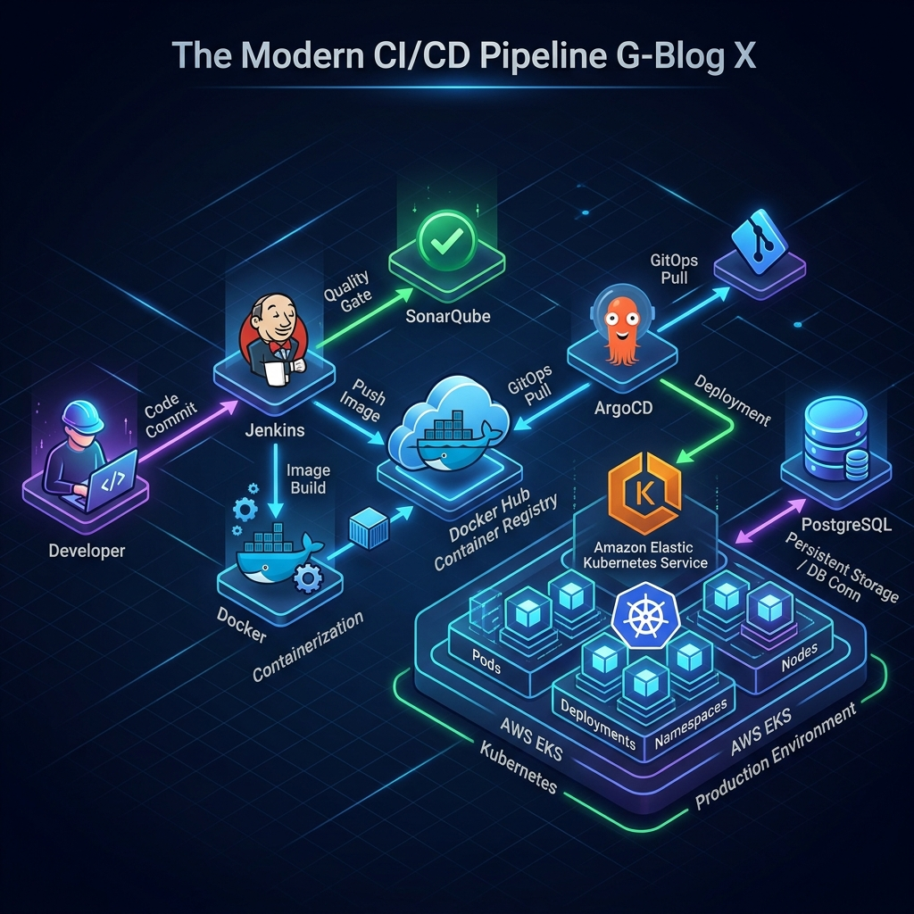
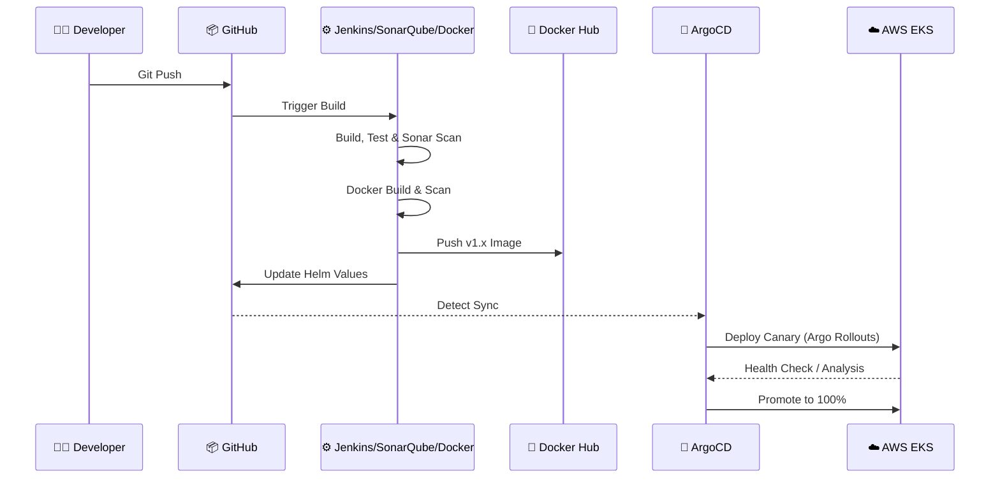

# Infrastructure & DevOps Stack: G-Blog X

### 🔄 The Deployment Flow (Step-by-Step)

## 1. Cloud Infrastructure (AWS)
| Component | Technology | Role |
| :--- | :--- | :--- |
| **VPC** | AWS VPC | Tiered networking (Public/Private/Data) |
| **Compute** | Amazon EKS | Kubernetes orchestrator for microservices |
| **Database** | Amazon RDS | Managed PostgreSQL 15 |
| **Connectivity** | NAT Gateway | Secure internet egress for private nodes |

## 2. DevOps & Automation Stack
This platform uses a hybrid CI/CD approach for maximum reliability.

### 2.1 Continuous Integration (CI)
- **Jenkins**: Primary orchestrator running on a dedicated EC2 node. Handles Terraform, multi-stage builds, and GitOps commits.
- **GitHub Actions**: Secondary CI for rapid developer feedback (unit tests & linting) on Pull Requests.
- **SonarQube**: Centralized server for Static Application Security Testing (SAST) and code quality gating.

### 2.2 Containerization & Registry
- **Docker Engine**: Used for building standardized images on the CI node and running them on EKS.
- **Docker Hub**: The central container registry. Images are tagged (e.g., `v1.0.1`) and pushed here before deployment.
- **Trivy**: Scans images in the registry for OS vulnerabilities.

### 2.3 Continuous Delivery (CD) & GitOps
- **ArgoCD**: Pulls the desired state from the Helm repository and reconciles it with the EKS cluster.
- **Argo Rollouts**: Manages **Canary Deployments** and automated rollbacks based on Prometheus metrics.

## 3. Application Components
- **Backend (Java 21 / Spring Boot 3.3.5)**: High-performance microservice providing the REST API, JWT handling, and database persistence.
- **Frontend (React 18 / Vite)**: Modern SPA providing the Glassmorphism UI and interacting with the Backend via Axios.

## 4. Security & Observability Layer
- **HashiCorp Vault**: Zero-trust secret management via sidecar injection.
- **OPA Gatekeeper**: Policy engine for Kubernetes admission control.
- **Prometheus/Grafana/Loki**: The "LGTM" stack for unified metrics and logging.
- **OpenTelemetry**: Standardized tracing and instrumentation across the stack.
